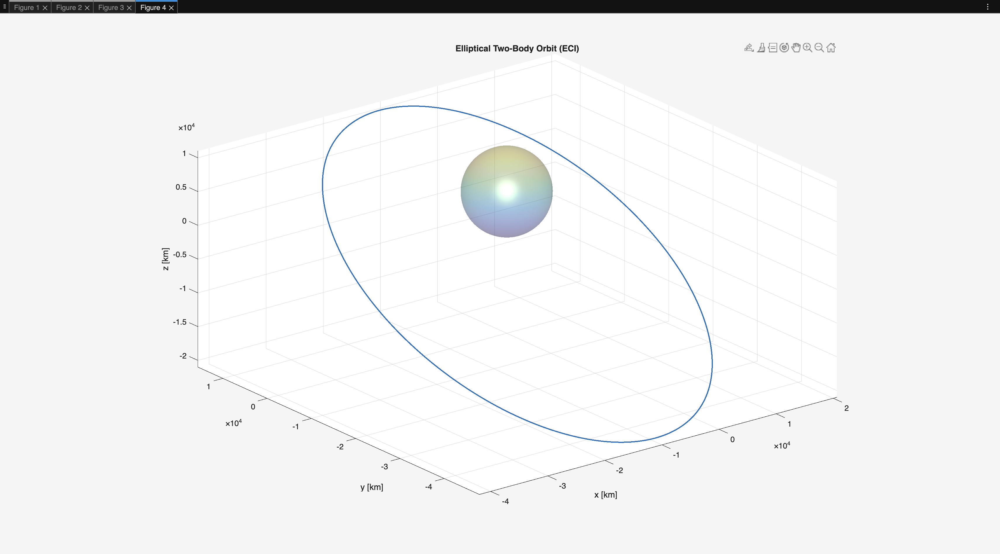
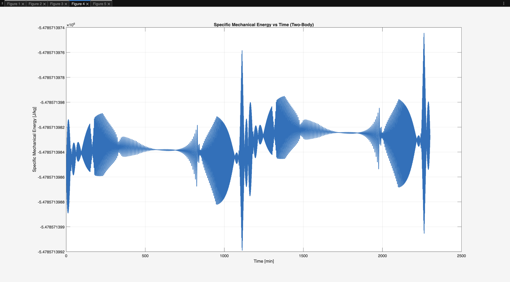

# Satellite-Orbit-and-Attitude-Simulation


I was inspired to get ahead of my USyd space units approaching later this year. Hence, this project implements a numerical two-body orbital mechanics propagator in MATLAB.  
It converts classical orbital elements into an Earth-centred inertial (ECI) Cartesian state and propagates the orbit by numerically integrating the two-body equations of motion.



The simulation is designed to demonstrate orbital dynamics modelling, numerical integration, and basic validation techniques used in astrodynamics and space systems engineering.

---

## Overview

The satellite motion is modelled using the ideal two-body point-mass equation:

dv/dt = - mu * r / |r|^3

where:
- r is the satellite position vector in ECI coordinates
- mu is Earth’s gravitational parameter

This second-order equation is rewritten as a first-order system and numerically integrated over time.

---

## Features

- Conversion from **classical orbital elements (COEs)** to ECI Cartesian position and velocity
- Numerical propagation of two-body dynamics using MATLAB’s adaptive Runge–Kutta solver (`ode45`)
- Physically meaningful integration interval based on the orbital period
- Time-history plots of position, velocity, and acceleration components
- 3D orbit visualisation including a rendered Earth
- Numerical validation via conservation of specific mechanical energy




---

## Methodology

1. **Orbit Definition**  
   The orbit is defined using perigee and apogee altitudes, from which the semi-major axis and eccentricity are computed. Orientation is specified using inclination, right ascension of the ascending node (RAAN), argument of perigee, and true anomaly.

2. **Initial State Generation**  
   Classical orbital elements are converted into ECI Cartesian position and velocity using standard perifocal-to-inertial rotation matrices.

3. **Numerical Integration**  
   The two-body equations are integrated as a six-state first-order system:
   
   dr/dt = v
   dv/dt = − mu * r / |r|³
   
   Integration is performed with `ode45` using tight relative and absolute error tolerances to ensure numerical accuracy.

5. **Time Span Selection**  
   The integration interval is defined in terms of the orbital period computed from Kepler’s third law, and the orbit is propagated over multiple revolutions.

6. **Validation**  
   Numerical accuracy is assessed by monitoring conservation of specific mechanical energy, which should remain constant for an ideal two-body system.

---

## Outputs

The script produces:
- Position, velocity, and acceleration component plots versus time
- Norms of position, velocity, and acceleration
- Energy variation diagnostic
- 3D ECI orbit plot with Earth visualisation


---

## How to Run

1. Open MATLAB
2. Place all files in the same directory
3. Run the main script:
   ```matlab
   TwoBodyOrbit.m
